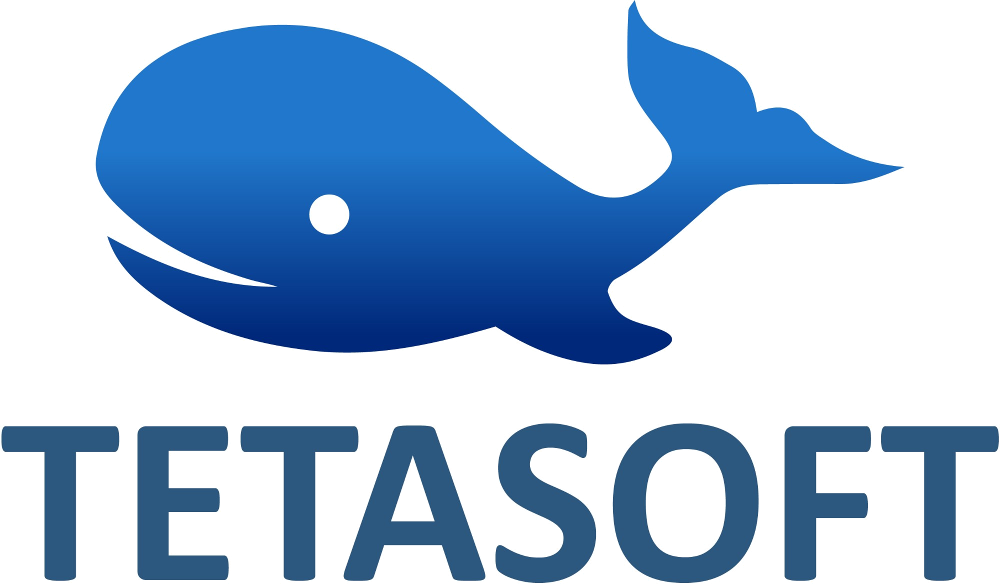

  

# Tetasoft A/S

Founded in 2003, Tetasoft A/S is an independent Danish SAP consultancy specialising in solution architecture and full-stack development on SAP S/4HANA and SAP BTP.

We help organisations design, build and modernise SAP solutions, from clean-core architecture to production-ready solutions. We work as an integrated part of our clients' teams and stay involved from the first architecture decisions through to stable operation.

## Services

- **Solution architecture:** lead architecture on S/4HANA greenfield programmes, tender solution designs and modernisation projects, with structured effort estimation and architecture governance.
- **Clean-core extensibility:** custom apps and services with RAP, CDS and OData, and migration of classic ABAP to ABAP Cloud.
- **SAP BTP development:** side-by-side extensions with SAP CAP, ABAP Environment, HANA Cloud, SAP Build Code and Work Zone.
- **Fiori & SAPUI5:** Fiori Launchpad and Work Zone design, Fiori Elements and freestyle SAPUI5 apps, and mobile solutions.
- **Integration:** SAP Integration Suite, SAP PO, OData, ALE/IDoc, EDI, RFC/BAPI and MQTT, built to keep maintenance low.
- **Technical leadership:** development standards, code review, performance tuning and coaching, so internal teams can take full ownership.

## Facts

| | |
|---|---|
| Founded | 2003 |
| Focus | SAP S/4HANA & SAP BTP |
| SAP experience | 25+ years, since 1997 |
| Industries | Pharma, utilities, manufacturing, transport, retail, finance, service, defence, public sector |
| Based in | Denmark, working internationally |
| VAT no. | DK28860617 |

## Contact

- Web: [www.tetasoft.dk](https://www.tetasoft.dk)
- Email: [info@tetasoft.dk](mailto:info@tetasoft.dk)
